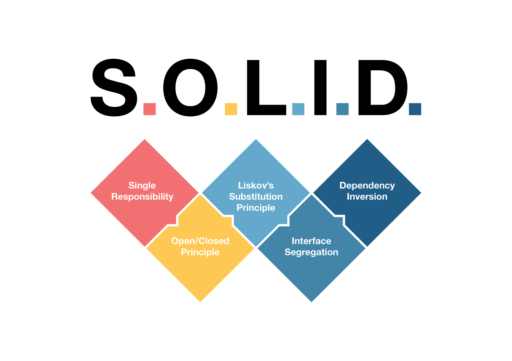

***• [Sitio Web ](https://www.solidjs.com/) • [Tutorial](https://www.solidjs.com/tutorial/introduction_basics) • [API](https://www.solidjs.com/docs/latest/api)  • [Area de Juego](https://playground.solidjs.com/)***

## ¿Qué es Solid?

SolidJS es un framework de interfaz de usuario (UI) desarrollado en TypeScript para construir aplicaciones web interactivas y reactivas. Se destaca por su enfoque en la reactividad y el rendimiento, y está diseñado para ser simple, rápido y escalable

## Principales caracteristicas

* **Programación reactiva:** SolidJS utiliza la programación reactiva que permite actualizaciones automáticas de la interfaz de usuario en respuesta a cambios en los datos.
* **Sintaxis declarativa:** SolidJS tiene una sintaxis que facilita la escritura y comprensión del código.
* **Tamaños de paquete reducidos:** El framework se compila en JavaScript, lo que se reducen los tamaños de paquete y una ejecución de código más rápida.
* **Arquitectura basada en componentes:** Se centra en el concepto de componentes, que son bloques de código reutilizables y autocontenidos en HTML, CSS y JavaScript.
* **Soporte de TypeScript:** SolidJS proporciona soporte completo para TypeScript, lo que permite escribir código seguro en cuanto a tipos.
* **Renderizado en el lado del servidor:** El framework admite el renderizado en el lado del servidor, mejorar el rendimiento y el SEO.

## Principios de SOLID  



 ## 1. Principio de Responsabilidad Unica

El principio de Responsabilidad Única es el más importante y fundamental de SOLID, muy sencillo de explicar, pero el más difícil de seguir en la práctica.
Una clase debe tener una única responsabilidad o motivo para cambiar.

<details>
<summary>Ejemplo</summary>

```js
  class Auto {
    constructor(marca, modelo) {
      this.marca = marca;
      this.modelo = modelo;
    }

    obtenerMarca() {
      return this.marca;
    }

    obtenerModelo() {
      return this.modelo;
    }

    guardarMarca(marca) {
      this.marca = marca;
    }

    guardarModelo(modelo) {
      this.modelo = modelo;
    }
  }
```

Como se puede observar, le hemos hecho modificaciones a la clase, sin alterar la funcionalidad previa, cumpliendo así con el principio.

</details>

## 2. Principio de Abierto/Cerrado

El principio nos dice que debemos ser capaces de extender el comportamiento de una clase/función sin modificar.

<details>
<summary>Ejemplo</summary>

```js
  class ProductosEnAlacena {
    productos = ["Piña", "Manzanas", "Harina"];

    existeProducto(producto) {
      // indexOf nos devuelve la posición del producto en el array,
      // si la posición es -1 significa que no existe el producto
      return this.productos.indexOf(producto) !== -1;
    }
  }
```

Si quisiéramos a la clase ProductosEnAlacena añadirle la posibilidad de ingresar más productos entonces haríamos lo siguiente:

```js
  class ProductosEnAlacena {
    productos = ["Piña", "Manzanas", "Harina"];

    existeProducto(producto) {
      // indexOf nos devuelve la posición del producto en el array,
      // si la posición es -1 significa que no existe el producto
      return this.productos.indexOf(producto) !== -1;
    }

    agregarProducto(producto) {
      this.productos.push(producto);
    }
  }
```
Como se puede observar, le hemos hecho modificaciones a la clase, sin alterar la funcionalidad previa, cumpliendo así con el principio.

</details>

## 3. Principio de sustitucion de Liskov

Los objetos de un programa deben ser reemplazables por instancias de sus subtipos sin alterar la corrección del programa.

<details>
<summary>Ejemplo</summary>

Si se está usando una clase Rectangulo y luego creas otra clase llamada Cuadrado que extiende de Rectangulo entonces cualquier objeto creado a partir de la clase Rectangulo puede ser cambiado por Cuadrado, obligándonos así a que cualquier clase hija no altere el comportamiento de la clase padre.

Entonces tendríamos un rectángulo:
```js
  class Rectangulo {
    ancho;
    alto;

    establecerAncho(ancho) {
      this.ancho = ancho;
    }

    establecerAlto(alto) {
      this.alto = alto;
    }

    calcularArea() {
      return ancho * alto;
    }
  }
```

Y tenemos una prueba escrita en mocha para comprobar el área:

```js
  describe("Validar área de un rectángulo ", function () {
    it("El área debe ser igual a alto * ancho ", function () {
      const rectangulo = new Rectangulo();
      rectangulo.establecerAncho(8);
      rectangulo.establecerAlto(2);
      const area = rectangulo.calcularArea();
      assert.equal(area, 16);
    });
  });
```

Si ejecutamos la prueba nos encontramos que el área debe ser equivalente a 16, resultado de multiplicar ancho (8) por alto (2).
Ahora creamos una clase Cuadrado que extiende de Rectangulo.

```js
  class Cuadrado extends Rectangulo {
    establecerAncho(ancho) {
      super.establecerAncho(ancho);
      super.establecerAlto(ancho);
    }

    establecerAlto(alto) {
      super.establecerAncho(alto);
      super.establecerAlto(alto);
    }
  }
```
Para validar que no rompimos el funcionamiento del padre, correremos la prueba sobre un objeto creado con la clase Cuadrado. Al correr la prueba nos daremos cuenta que ha fallado, pues ahora un cuadrado escribe el ancho y alto como el mismo valor imposibilitando tener el área de un rectángulo con lados diferentes.
Hasta éste punto te estarás preguntando como solucionarlo, y creo que has de estar pensando en diferentes posibilidades. La primera y más sencilla puede ser abstraer la lógica a una clase superior quedando el código de la siguiente manera:

```js
  class Paralelogramo {
    constructor(ancho, alto) {
      this.establecerAncho(ancho);
      this.establecerAlto(alto);
    }

    establecerAncho(ancho) {
      this.ancho = ancho;
    }

    establecerAlto(alto) {
      this.alto = alto;
    }

    calcularArea() {
      return this.ancho * this.alto;
    }
  }

  class Rectangulo extends Paralelogramo {
    constructor(ancho, alto) {
      super(ancho, alto);
    }
  }

  class Cuadrado extends Paralelogramo {
    constructor(lado) {
      super(lado, lado);
    }
  }
```

</details>

## 4. Principio de segregacion de la interfaz

El principio nos indica que una clase debe de implementar únicamente las interfaces que necesita, es decir, que no necesite tener que implementar métodos que no utilice. El propósito de este principio es obligarnos a escribir interfaces pequeñas buscando aplicar el principio de cohesión en cada interfaz.

<details>
<summary>Ejemplo</summary>

Imaginemos que tenemos un negocio de venta de computadoras de escritorio, sabemos que todas las computadoras deberían de extender de la clase Computadora y tendríamos algo como esto:

```js
  class Computadora {
    marca;
    modelo;

    constructor(marca, modelo) {
      this.marca = marca;
      this.modelo = modelo;
    }

    obtenerMarca() {
      return this.marca;
    }

    obtenerModelo() {
      return this.modelo;
    }

    guardarMarca(marca) {
      this.marca = marca;
    }

    guardarModelo(modelo) {
      this.modelo = modelo;
    }
  }

  class ComputadoraDell extends Computadora {
    ...
  }
```

En nuestro negocio todo va de maravilla y ahora queremos extender un poco más nuestro catalogo de productos, así que decidimos optar por empezar a vender computadoras portátiles. Un atributo útil de una portátil es el tamaño de la pantalla integrada, pero como bien sabemos esto solo esta presente en las portátiles y no computadoras de escritorio (generalizando), al inicio podemos pensar que una implementación podría ser:

```js
  class Computadora {
    ...
    constructor() {
      ...
    }
    ...
    guardarTamanioPantalla(tamanio) {
      this.tamanio = tamanio;
    } 
    obtenerTamanioPantalla() {
      return this.tamanio;
    }
  }
  class PortatilHP extends Computadora {
    ...
  }
```

El problema que tenemos con esta implementación es que no todas las clases, por ejemplo la EscritorioDell, requieren los métodos para leer y escribir el tamaño de la pantalla integrada, entonces deberíamos de pensar en separar ambas lógicas en dos interfaces quedando nuestro código así:

```js
  class Computadora {
    marca;
    modelo;

    constructor(marca, modelo) {
      this.marca = marca;
      this.modelo = modelo;
    }

    obtenerMarca() {
      return this.marca;
    }

    obtenerModelo() {
      return this.modelo;
    }

    guardarMarca(marca) {
      this.marca = marca;
    }

    guardarModelo(modelo) {
      this.modelo = modelo;
    }
  }

  class TamanioPantallaIntegrada {
    tamanio;
    constructor(tamanio) {
      this.tamanio = tamanio;
    }

    guardarTamanioPantalla(tamanio) {
      this.tamanio = tamanio;
    }

    obtenerTamanioPantalla() {
      return this.tamanio;
    }
  }

  class PortatilAsus implements <TamanioPantallaIntegrada, Computadora> {
    ...
  }
```

Todo suena perfecto, pero ¿te has dado cuenta del problema?, y es que JavaScript solo soporta una clase padre, entonces la solución sería aplicar un mixin, este sería el código utilizando un mixin:

```js
  class Computadora {
    marca;
    modelo;

    constructor(marca, modelo) {
      this.marca = marca;
      this.modelo = modelo;
    }

    obtenerMarca() {
      return this.marca;
    }

    obtenerModelo() {
      return this.modelo;
    }

    guardarMarca(marca) {
      this.marca = marca;
    }

    guardarModelo(modelo) {
      this.modelo = modelo;
    }
  }

  const Portatil = (clasePadre) => {
    return (
      class extends clasePadre {
        constructor(marca, modelo){
          super(marca, modelo);
        }

        guardarTamanioPantalla(tamanio) {
          this.tamanio = tamanio;
        }

        obtenerTamanioPantalla() {
          return this.tamanio;
        }

      }
    )
  }

  class PortatilAsus extends Portatil(Computadora) {
    ...
  }
```

</details>

## 5. Principio de inversion de dependencia

En este principio se establecen que las dependencias deben de estar en las abstracciones y no en las concreciones, en otras palabras, nos piden que las clases nunca dependan de otras clases y que toda esta relación debe estar en una abstracción. Este principio tiene dos reglas:

1. Los módulos de alto nivel no deben de depender de módulos de bajo nivel. Esta lógica debe de estar en una abstracción.
2. Las abstracciones no deben de depender de detalles. Los detalles deberían depender de abstracciones.

<details>
<summary>Ejemplo</summary>

```js
  class Correo {
    provider;

    constructor() {
      // Levantar una instancia de google mail, este código es con fin de demostración.
      this.provider = gmail.api.createService();
    }

    enviar(mensaje) {
      this.provider.send(mensaje);
    }
  }

  var correo = new Correo();
  correo.enviar('hola!');
```

En este ejemplo se puede ver que se está rompiendo la regla, puesto que la clase correo depende del proveedor de servicio, ¿qué pasaría si después queremos usar Yahoo y no Gmail?

Para solucionar esto debemos eliminar esa dependencia y añadirla como una abstracción

```js
  class GmailProveedor {
    constructor() {
      // Levantar una instancia de google mail, este código es con fin de demostración.
      this.provider = gmail.api.createService();
    }
    enviar(mensaje) {
      this.provider.sendAsText(mensaje);
    }
  }
  class Correo {
    constructor(proveedor) {
      this.proveedor = proveedor;
    }
    enviar(mensaje) {
      this.proveedor.send(mensaje);
    }
  }
  var gmail = new GmailProveedor();
  var correo = new Correo(gmail);
  correo.enviar('hola!');
```

De esta forma ya no nos importa el proveedor ni la forma en que implementa el envío de correos el proveedor, la clase de Correo solo se ocupa de una única cosa, pedirle al proveedor que envíe un correo.

</details>

## ¿Cuáles son los beneficios de los principios SOLID?

Los desarrolladores, cuando se adhieren a los principios SOLID, logran crear un software que ofrece los siguientes beneficios:

**1. Mejora la calidad del software:** Los principios SOLID promueven un diseño limpio y coherente, lo que reduce la probabilidad de errores y facilita la detección y corrección de problemas.
**2. Facilita el mantenimiento:** Los sistemas diseñados siguiendo estos principios son más fáciles de mantener a lo largo del tiempo, ya que los cambios y extensiones se pueden realizar con menor riesgo de romper el código existente.
**3. Favorece la reutilización:** El diseño basado en interfaces y la separación de responsabilidades permiten la reutilización de componentes en diferentes partes del sistema.
**4. Facilita la colaboración:** Los equipos de desarrollo pueden trabajar de manera más eficiente al comprender y confiar en la estructura y el comportamiento de las clases y módulos diseñados de acuerdo con los principios SOLID.
**5. Mejora la legibilidad y la comprensión del código:** los principios SOLID conducen a un código más organizado y estructurado, lo que facilita a los desarrolladores entender y modificar el software.

## Conclusión

La utilización de SolidJS como framework para el desarrollo de aplicaciones web ofrece ventajas significativas en términos de reactividad eficiente, integración con TypeScript, simplicidad en la sintaxis, rendimiento optimizado y comunidad activa. Estas características hacen que SolidJS sea una opción atractiva para desarrolladores que buscan construir aplicaciones web modernas, robustas y eficientes.
